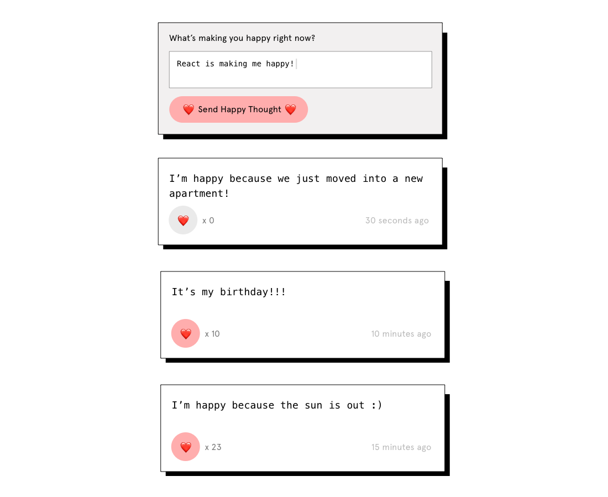

Course Syllabus for the whole course : React and Global State Management
Scope of the Course: 30 YH credits (6 full weeks)

Programme Affiliation: Frontend Developer / JavaScript Developer

Programme to which the Course Belongs: JavaScript Development (160 YH credits)

Decision on Confirmation: 2/6-2025

Purpose and Objectives
The purpose of the course is to provide the student with practical and theoretical knowledge of React, one of the most widely used JavaScript libraries for building modern web applications. Throughout the course, the student will build several responsive and interactive projects while learning how to manage application state, both locally and globally, using tools such as the Context API and Zustand.

Upon completion of the course, the student should be able to:

Build responsive web apps using React and styled components
Create and compose reusable components using JSX
Manage state with useState, useEffect, and global state libraries
Work with routing using React Router
Handle asynchronous API requests in a React application
Implement accessibility and clean code practices in React projects
After completing the course, the student should have acquired the following knowledge, skills, and competencies:

Knowledge

Understanding the problems React is built to solve
Knowledge of React hooks and component lifecycle
Understanding of global vs local state in React applications
Familiarity with CSS-in-JS and component-based styling approaches
Awareness of accessibility standards in React-based applications
Skills

Write and structure React applications using components and props
Use useState, useEffect, and other built-in hooks effectively
Implement routing with React Router to create multi-page experiences
Connect to APIs and display asynchronous data
Style components using Styled Components and manage styles dynamically
Use Zustand and the Context API to manage global state
Competencies

Independently build and deploy React applications with multiple pages and dynamic content
Create accessible, responsive user interfaces that follow design specifications
Use clean code principles when writing and refactoring React code
Debug and test React components using Chrome DevTools and browser-based testing tools
Collaborate effectively in a team using GitHub, code reviews, and agile methods
Grading and Assessment
Grades are set either Fail (IG), Pass (G) or Pass with Distinction (VG).

Fail (IG): The student has completed the course but has not achieved all course requirements
Pass (G): The student has achieved all course requirements
Pass with Distinction (VG): The student has achieved all course requirements as well as the VG requirements.
Knowledge assessment is conducted through four code project hand-ins. After the course has ended, the students’ hand-ins will be evaluated by the teachers.

Assessment Criteria  for the whole course - React and Global State Management
💡 Deadlines
Hand in continuously throughout the sprint to get feedback. This is also so that your teammates can do code reviews.

1. Portfolio project - 30th of November (code review deadline 14th of December)
2. Happy Thoughts messaging app - 14th of December (code review deadline 21st of December)
3. Movies app - 21st of December
4. Todo app - 18th of January

Grade G (Pass) Requirements
Project 1: Portfolio project
Requirements:

Your portfolio should have components and props
Your portfolio should contain:
A picture of you
A presentation of your tech skills
A presentation of your projects linking to GitHub and Netlify. 
A presentation of some thoughts that you have around code. (If you didn't write an article last week - use placeholder text for now)
A clear way to get in contact with you
Your portfolio should use styled components
Your portfolio should follow the Figma design
Your code should follow the guidelines on how to write clean code
Your portfolio should follow accessibility guidelines to ensure your website is usable by a diverse range of users:
You should have a score of at least 95 in Lighthouse
All images should have alt attributes and proper sizes
All contrasts should be OK
Your portfolio should be responsive (it should look good on devices from 320px width up to at least 1600px)
Project 2: Happy Thoughts messaging app
Requirements:

Your app should follow the design
Your app should be responsive (it should look good on devices from 320px width up to at least 1600px)
Your app should have a text area and a submit button. When the button is clicked, your app should empty the form and show the form submission in a message card according to the design.
Your code should follow the guidelines on how to write clean code
On form submission, the happy thoughts should be posted to the API
The happy thoughts should be listed (most recent thoughts at the top and older thoughts at the bottom) and rendered on page load and updated after form submission
The happy thoughts should show the content of the message and how many likes they've received
Each happy thought should include a heart button that sends likes. The number should increase after a user has liked a thought.
Project 3: Movies app
Requirements:

Your app should have at least two pages - one showing a list of movies and one showing details
You should use React Router.
You should follow the design from our example (it's OK to change things - just make sure it looks nice)
Follow the guidelines on how to write clean code
Make your app responsive (it should look good on devices from 320px width up to at least 1600px)
Your project should follow accessibility guidelines to ensure your website is usable by a diverse range of users:
You should have a score of at least 95 in Lighthouse
All images should have alt attributes and proper sizes
All contrasts should be OK
Project 4: Todo app
Requirements:

You should use Zustand for global state management. No prop-drilling.
Your app should list all tasks - completed and uncompleted
You should be able to mark an uncompleted task as complete (and change it back to uncompleted)
You should be able to add and remove tasks
Your app should show a count of the tasks. Either all tasks or all uncompleted tasks (or both)
You should make your app look nice when there's no data. See empty states UX design for some ideas.
Make your app responsive (it should look good on devices from 320px width up to at least 1600px)
Your project should follow accessibility guidelines to ensure your website is usable by a diverse range of users:
You should have a score of at least 95 in Lighthouse
All images should have alt attributes and proper sizes
All contrasts should be OK
Follow the guidelines on how to write clean code
Course Participation Requirements
Active participation in mob/pair programming workshops
Regular attendance at weekly demos and retrospectives
Completion of (at least) two peer code reviews
Grade VG (Pass with Distinction) Requirements
All Grade G requirements plus implementing a minimum of 2 stretch goals on a minimum of 3 projects.

Project 1: Portfolio project
Stretch goal options:

Implement animation on scroll as presented in the design for enhanced user experience.
Optimise your website for sharing on social media using og:tags.
Add a favicon
Give your portfolio a custom domain and connect it to your deployed site. Read more.
Project 2: Happy Thoughts messaging app
Stretch goal options:

Show a count below the form input that updates as the user types and shows how many characters are remaining. Make it go red when the user has typed over 140 characters
When POSTing a new thought, if the message was empty, too long, or too short, you get an error message in the UI. Use this to set some sort of error state to show a friendly message to your user.
Add an animation for when a new thought is submitted and appears in the list below
Keep count of how many different posts you have liked (different from how many times a post has been liked). Keep count and display it in some way. You could even go as far as to store this number in localStorage so that when the page is reloaded, the initial state can be set from the number you've stored.
Handle loading states. See hint below 👇 When you initially fetch the list of recent thoughts, it might take a little time to get the response back from the API. During this time, you could show a loading message or spinner of some sort on the page. Use something like const [loading, setLoading] = useState(true) to make it so the page is loading by default, then call setLoading(false) once you get the response back from the API. With the new thought form and the heart button, you could choose to also show a loading state, or you could opt to do an optimistic update which means you update the UI before the API request has succeeded (making the assumption that it will be successful).
Project 3: Movies app
Stretch goal options:

Show a 'not found' page if you try to visit a movie detail page with an invalid movie ID (so the user has tried to enter an ID themselves, most likely).
In this case, when you send a movie detail request with a movie ID which doesn't exist in the API, the API returns with a 404 response. You can use .catch() on your promise to catch this exception and toggle some sort of 'error' state which can be used to show an error page.
Handle loading states - The API responds quite quickly, but if you're on a slow network then you'd be faced with a black screen until the response comes back. During this time, you could show a loading message or spinner of some sort on the page.
Use something like const [loading, setLoading] = useState(true) to make it so the page is loading by default, then call setLoading(false) once you get the response back from the API.
You could also investigate how to handle the loading of images - or show plain text by default and then use CSS to place the image over the text (using absolute positioning). This way, if the images take a long time to load, the user still sees something relevant.
On the homepage where you list popular movies, you could add a dropdown to change the list. For example, you could toggle between popular, upcoming, and new releases.
When you load a movie, you get a lot of information in the API response, such as a collection it belongs to, genres it has, or the companies involved with producing the film. Each of these has an API endpoint that can be used to fetch more information about that entity. You could use this data to make links from your movie page to another page. Take a look through the documentation and be creative!
Project 4: Todo app
Stretch goal options:

Add a timestamp for each task indicating when it was created. The timestamp should be displayed as a formatted date but stored as a raw date. You can use a third-party library, such as date-fns or Moment.js for this.
Add a complete all button to set all tasks as completed.
Add a button to switch dark/light mode.
Implement local storage
Add a date input to your new task form to set a due date on a task. It could be required, or optional - it's up to you. You could then display this in the list and style it differently when a task is overdue.
Add filters to display completed/uncompleted tasks, tasks created after a given date or anything else you consider important.
Create categories/tags for tasks so they can be grouped - for example, 'Housework', 'Shopping', etc.
Create projects for tasks → A project could be a group of tasks which all need to be completed, and when they are completed, the project is marked as complete.

Week 13 | React Basics: Props & Components
Hey you! 💪
This is an exciting week in this bootcamp – we're finally starting with React, and you will build your very own portfolio! As mentioned last week, this is the type of project you might never feel entirely finished with (because you will fill it with new stuff continuously). With this said, the project will be built over two weeks.

What you will learn
✓ Understand the role of Node.js & npm for running JS scripts
✓ What problems React solves
✓ What a boilerplate project is and how to run the Technigo React starter project
✓ How to write JSX and React components
✓ How to use React props to feed information to components
✓ How to structure React projects into small chunks
✓ Practice breaking up a project into components based on a fixed design

🎯 This week's material is on React. If you also want to sneak peek at next week's material about Figma, feel free.

Project instructions
This week, you will start building your portfolio, focusing mainly on the structure and content. During next week, we're going to dive into its design. Try to keep the styling during this week to a minimum since we will explore a new approach to styling next week.

👉 Fork and clone this repo to get started.

💡Some words about the designs
Next week, you will practise following a design strictly. This is a normal workflow for a Web Developer: working with a designer who provides a design file (in Figma) for you to translate into code. These designs come from an experienced designer, in collaboration with a recruiter who understands what recruiters look for. If you're not happy with the design of this project, you are free to create your own personal portfolio outside of this course.

However, for this project, you are free to change:
- the colours (find inspiration on ColorHunt or Adobe)
- the images
- and, of course, all the content

Requirements
Your portfolio should have components and props
Your portfolio should contain:
A picture of you
A presentation of your tech skills
A presentation of your projects linking to GitHub and Netlify. 
A presentation of some thoughts that you have around code. (If you didn't write an article last week - use placeholder text for now)
A clear way to get in contact with you
Your code should follow the guidelines on how to write clean code
Your portfolio should follow accessibility guidelines to ensure your website is usable by a diverse range of users:
You should have a score of at least 95 in Lighthouse
All images should have alt attributes and proper sizes
All contrasts should be OK
Stretch goals
Optimise your website for sharing on social media using og:tags.
Implement animation on scroll as present in the design for enhanced user experience.
Add a favicon
Give your portfolio a custom domain and connect it to your deployed site. Read more.
Tips & tricks
Before starting to code, consider what components you need and break the design up into reusable and manageable pieces.
Consider how you will get the data, e.g. the projects and articles. We set up a JSON file that you can use for your project.
To use the icons from the Figma design, simply mark the icon you want to export and save it as an SVG or copy the code and make it into a component.
Remember that your portfolio will continue to evolve and grow as you progress in your coding journey. Happy coding!

Try focusing on React and the structure this week so that all the content is up and ready for next week, when we will deep dive into Figma and CSS libraries 🚀

Week 14 | CSS Libraries
Hola! 👩‍🎨
Now is the time to start styling your portfolio! We will learn about two different CSS libraries this week: Tailwind and Styled Components. For the portfolio, you will use Styled Components.

What you will learn
✓ Practice breaking up a project into components, based on a fixed design
✓ Access and inspect a design on Figma
✓ Implement a design from a real designer

Project instructions
This week, you will start styling your portfolio. Apart from last week's requirements, here is what is required regarding the styling.

Requirements
Your portfolio should use styled components
Your portfolio should follow the Figma design
Your portfolio should be responsive (it should look good on devices from 320px width up to at least 1600px)

💡Some words about the designs
We want you to practise following a design strictly. This is a normal workflow for a Web Developer: working with a designer who provides a design file (in Figma) for you to translate into code. These designs come from an experienced designer, in collaboration with a recruiter who understands what recruiters look for. If you're not happy with the design of this project, you are free to create your own personal portfolio outside of this course.

However, for this project, you are free to change:
- the colours (find inspiration on ColorHunt or Adobe)
- the images
- and, of course, all the content

Stretch goals
Implement animation on scroll as presented in the design for enhanced user experience.

Week 15 | React State & Controlled forms
Hi there! 💌
This week, we're finally going to use React to its full potential by introducing State. You will create the foundation for a little happy thoughts messaging app. Think of it as our own version of X, but with less negativity and 100% fewer Elon Musks using it.

What you will learn
✓ The purpose of state in React
✓ How to use the useState hook in React
✓ How to connect form inputs to state
✓ How to use form fields with React

Project instructions
This week, we will focus on the form elements and the styling of the messaging app, and next week we will be connecting it to an API and work with fetching in React. It's up to you if you build it solo, in pairs or in small groups.

👉 Fork and clone this repo to get started.

finished-example__1_.png
Requirements
Your page should follow the design as closely as possible
Your app should be responsive (it should look good on devices from 320px width up to at least 1600px)
Your app should have a text area and a submit button. When the button is clicked, your app should empty the form and show the form submission in a message card according to the design.
Your code should follow the guidelines on how to write clean code
Stretch goals
Show a count below the form input that updates as the user types and shows how many characters are remaining. Make it go red when the user has typed over 140 characters
When POSTing a new thought, if the message was empty, too long, or too short, you get an error message in the UI. Use this to set some sort of error state to show a friendly message to your user.
Add an animation for when a new thought is submitted and appears in the list below

Week 16 | Component Lifecycle and useEffect hook

Bonjour! 💌
This week, we are going to learn what the lifecycle for a component is. We will be introducing another great hook to use in React called “useEffect”. We will take a look into how to work with API’s in React and how to utilise the tool Postman.

What you will learn
✓ What component lifecycle means
✓ How to use the useEffect hook in React to perform actions when components mount, unmount, or when the state changes.
✓ How to call APIs from React and put the data into state.
✓ What it's like to work with an API from which you both send and receive data.
✓ How to use Postman

Project instructions
This week, you will continue building your happy thoughts messaging app. We've built an API with three endpoints. Note that all of the thoughts you write will show up for everyone - this is a public API that you will all share.

Requirements
Apart from the requirements stated last week:

On form submission, the happy thoughts should be posted to the API
The happy thoughts should be listed (most recent thoughts at the top and older thoughts at the bottom) and rendered on page load and updated after form submission
The happy thoughts should show the content of the message and how many likes they've received
Each happy thought should include a heart button that sends likes. The number should increase after a user has liked a thought.
Stretch goals
Keep count of how many different posts you have liked (different from how many times a post has been liked). Keep count and display it in some way. You could even go as far as to store this number in localStorage so that when the page is reloaded, the initial state can be set from the number you've stored.
Handle loading states. See hint below 👇 When you initially fetch the list of recent thoughts, it might take a little time to get the response back from the API. During this time, you could show a loading message or spinner of some sort on the page. Use something like const [loading, setLoading] = useState(true) to make it so the page is loading by default, then call setLoading(false) once you get the response back from the API. With the new thought form and the heart button, you could choose to also show a loading state, or you could opt to do an optimistic update which means you update the UI before the API request has succeeded (making the assumption that it will be successful).
Tips & Tricks
A good idea before you start writing code is to sketch out what kind of components you need, what their responsibility should be, and what kind of state you'll need. This will help you to have a clearer idea of what code you need to write. Once you've done that, a good idea is to start with listing the thoughts which are already in the API. Then move on to building a form to post a new thought, and finally implement the heart button on an existing thought.

Fetch recent thoughts

GET https://happy-thoughts-api-4ful.onrender.com/thoughts

This will return the latest 20 thoughts from the API, looking something like this:

[
  {
    "_id": "5dd671c864cc480017f40979",
    "message": "I'm happy because we're starting a fun new project",
    "hearts": 0,
    "createdAt": "2019-11-21T11:15:20.888Z",
    "__v": 0
  },
  {
    "_id": "5dd6759064cc480017f4097a",
    "message": "I just ate a super tasty lunch",
    "hearts": 0,
    "createdAt": "2019-11-21T11:31:28.547Z",
    "__v": 0
  }
]

Create a thought

POST https://happy-thoughts-api-4ful.onrender.com/thoughts

Send a POST request with a JSON body like this:

{
  "message": "My happy thought"
}
If the request was successful and a thought was added, you'll get a response that looks like this:

{
  "_id": "123456",
  "message": "My happy thought",
  "hearts": 0,
  "createdAt": "2019-11-21T11:31:28.547Z",
  "__v": 0
}
The message you send is validated - it must be present and be between 5 and 140 characters long. If it fails these validations, you'll get a response with detailed error information, which you could use to show a friendly error to the user.

Like a thought

POST https://happy-thoughts-api-4ful.onrender.com/thoughts/THOUGHT_ID/like

When the user clicks the heart button on a thought, send a POST request to this URL. Replace THOUGHT_ID with the _id parameter of the thought the user clicked on

Hint to complete the project

When you submit the form to add a new thought, the API returns the new thought object in the same way it would look if it was part of the full list response. You can use this to avoid having to send a second API request to fetch all thoughts again after submitting a new thought. See the react documentation for a more detailed explanation of adding an object to an existing array in state, but in a nutshell, you'll want to do something like this:

// Assuming you have this kind of state in your component:
const [thoughts, setThoughts] = useState([])

// Later, in your code which handles the form submission, you
// could have something which looks like this to send the new
// message, get the response from the API, and then add it to
// the thoughts array:
const handleFormSubmit = (event) => {
  event.preventDefault()

  // Send the POST request with the input from your form (instead
  // of 'Hello world' like this example does):
  fetch("<https://technigo-thoughts.herokuapp.com/>", {
    method: "POST",
    body: JSON.stringify({
      message: "Hello world",
    }),
    headers: { "Content-Type": "application/json" },
  })
    .then((res) => res.json())
    .then((newThought) => {
      // Now you have `newThought` which is the response from the
      // API as documented at the top of this readme. You can use
      // it to update the `thoughts` array:
      setThoughts((previousThoughts) => [newThought, ...previousThoughts])
    })
}

Course Material

6/19 Modules Completed

🐟 Week 13 | Node.js & npm

LESSON
What is Node.js & npm?

VIDEO
Intro to Node.js & npm

LESSON
Tool: Node.js

🐟 Week 13 | React Intro

LESSON
What is React?

VIDEO
React Introduction

LESSON
New React tools

LESSON
React Virtual DOM

VIDEO
React Deep-dive

🐟 Week 13 | Components & JSX

LESSON
What are components?

LESSON
What is JSX?

VIDEO
Intro to Components and JSX

VIDEO
Components deep-dive

🐟 Week 13 | Props

LESSON
What are props?

VIDEO
Intro to Props

VIDEO
Props deep-dive

🐟 Week 13 | Thinking in React

VIDEO
Thinking in React

LESSON
Thinking in React deep-dive

🦈 Week 14 | Styled Components

LESSON
Styled Components Introduction

VIDEO
Styled Components

LESSON
Styled Components' class names

LESSON
Styled components deep-dive

🦈 Week 14 | Tailwind

0%

LESSON
Tailwind CSS Introduction

VIDEO
Tailwind CSS

LESSON
Tailwind deep-dive

🦈 Week 14 | Figma

0%

LESSON
Intro to Figma

LESSON
Figma for developers

LESSON
Figma Dev Mode

LESSON
How to import assets from Figma

LESSON
How to inspect interactive elements in Figma

LESSON
Figma Deep-dive

🐳 Week 15 | React State

0%

LESSON
What is the App State?

VIDEO
State introduction

VIDEO
React State deep-dive

🐳 Week 15 | Controlled Forms

0%

LESSON
What is a controlled form

VIDEO
Controlled Forms introduction

🐙 Week 16 | Component Lifecycle and React hook useEffect

0%

LESSON
What are Component lifecycle and useEffect?

VIDEO
Component lifecycle and useEffect

VIDEO
useEffect deep-dive

🐙 Week 16 | Working with APIs in React

0%

VIDEO
APIs in React

VIDEO
Using Postman for API calls

🐙 Week 16 | Moment.js

0%

LESSON
What is Moment.js?

VIDEO
Moment.js Introduction

